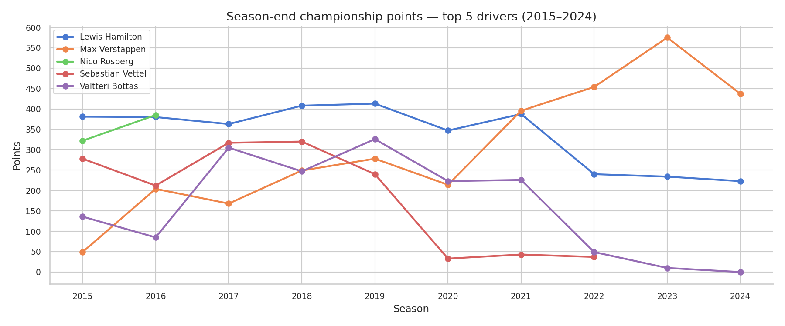
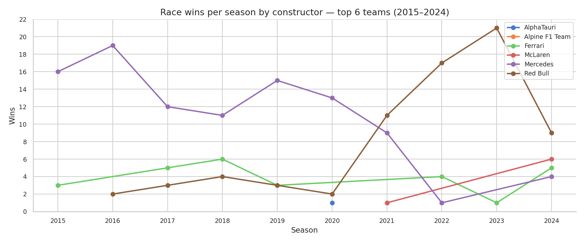
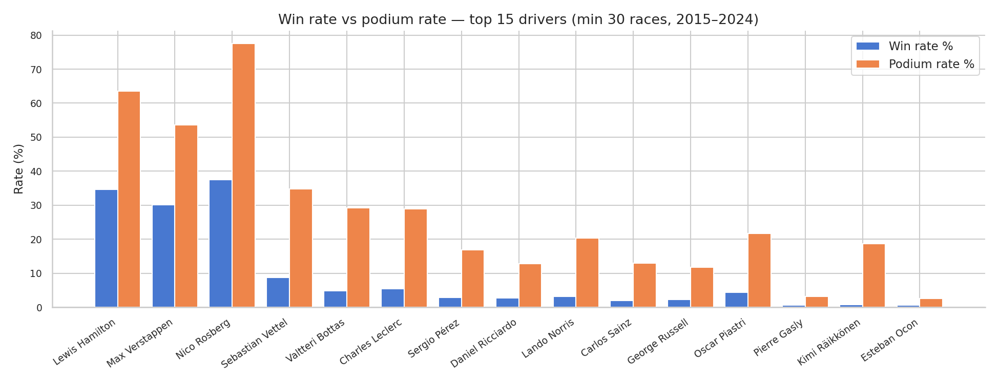
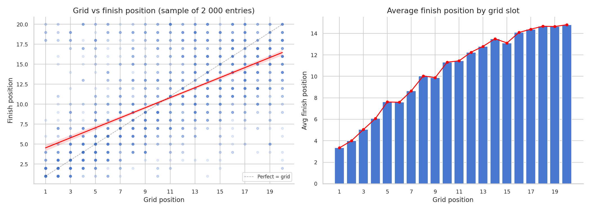

# Python F1 Performance Analysis — Motorsport EDA & Web Scraping (2015–2024)

---

## Executive Summary

This project scrapes, cleans, and analyses 10 seasons of Formula 1 race data (2015–2024) using the Jolpica F1 public API — a real-world data source with no pre-built dataset to rely on. The analysis covers 4,219 race entries across 10 seasons, uncovering patterns in driver dominance, constructor performance, and the statistical relationship between qualifying position and race outcome.

Key findings include Mercedes winning 100 races across the decade, Lewis Hamilton leading all drivers with 72 wins, and a strong correlation (r = 0.62) between grid position and finish position — with pole sitters converting to race wins 52.9% of the time.

**Business impact:** Demonstrates a full end-to-end data analytics workflow — API scraping, data cleaning, feature engineering, EDA, and storytelling — applied to a globally recognised sport with millions of data points and real competitive stakes.

---

## Business Problem

Formula 1 generates enormous volumes of race data each season, but raw results alone rarely tell the full story. Teams, analysts, and motorsport strategists need to answer questions like:

- Which drivers and constructors have genuinely dominated the modern era?
- Does qualifying performance reliably predict race day success?
- How have team power dynamics shifted across seasons?
- Where are the performance gaps between top and mid-field teams?

This project simulates the work of a sports data analyst tasked with building a performance intelligence report across a decade of F1 competition — using only publicly available data, scraped and processed entirely in Python.

---

## Methodology

### 1. Data Collection — Web Scraping via API
- Scraped live data from the **Jolpica F1 API** (the maintained successor to the now-defunct Ergast API)
- Pulled three separate endpoints: driver standings, constructor standings, and race results
- Handled **API pagination** automatically to retrieve all records per season
- Implemented polite rate limiting (`time.sleep`) to avoid overloading the server
- Collected data across all 10 seasons (2015–2024) in a single automated loop

### 2. Data Cleaning & Feature Engineering
- Converted `finish_position` from mixed-type (numeric + DNS/DNF strings) to numeric using `pd.to_numeric(errors='coerce')`
- Engineered three boolean performance columns: `win`, `podium`, `dnf`
- DNF detection used keyword matching against the `status` field (e.g. "Retired", "Collision", "Engine")
- Parsed date strings to `datetime` objects for time-based analysis
- Computed `win_rate` and `podium_rate` per driver and constructor

### 3. Exploratory Data Analysis
- Grouped and aggregated by driver, constructor, and season using `pandas` `groupby`
- Built summary tables with total races, wins, podiums, points, and derived rates
- Filtered to drivers with 30+ race starts for meaningful rate comparisons
- Calculated Pearson correlation between grid position and finish position

### 4. Visualisation
- 4 publication-quality charts built with `matplotlib` and `seaborn`
- Exported as high-resolution `.png` files for GitHub embedding

---

## Skills & Tools Used

**Python Libraries**
- `requests` — API calls and pagination handling
- `pandas` — data wrangling, groupby aggregations, feature engineering
- `numpy` — numerical operations
- `matplotlib` — chart construction and layout
- `seaborn` — styled statistical visualisations

**Techniques**
- REST API scraping with pagination
- Data type coercion and null handling
- Boolean feature engineering from text fields
- Correlation analysis
- Multi-panel chart design

**Environment**
- Google Colab
- GitHub for version control

---

## Project Structure

```
f1-performance-analysis/
│
├── data/
│   ├── f1_driver_standings_2015_2024.csv
│   ├── f1_constructor_standings_2015_2024.csv
│   └── f1_race_results_2015_2024.csv
│
├── charts/
│   ├── chart1_driver_points_trend.png
│   ├── chart2_constructor_wins.png
│   ├── chart3_driver_win_podium_rate.png
│   └── chart4_grid_vs_finish.png
│
├── notebook/
│   └── f1_analysis.ipynb
│
└── README.md
```

---

## Key Questions Answered

| Question | Finding |
|---|---|
| Who dominated the 2015–2024 era? | Lewis Hamilton (72 wins), Max Verstappen rising sharply from 2021 |
| Which constructor won most? | Mercedes (100 wins), dominant 2015–2020, challenged from 2021 |
| Does qualifying predict the race? | Yes — grid/finish correlation of r = 0.62 |
| How often does pole win? | 52.9% of the time across 10 seasons |
| Who has the best win rate? | Hamilton and Verstappen lead all drivers with 30+ starts |

---

## Visualisations

### Chart 1 — Driver championship points trend (2015–2024)
> Tracks season-end points for the top 5 drivers, showing Hamilton's dominance and Verstappen's rise.



---

### Chart 2 — Constructor race wins per season
> Shows how team dominance shifted — Mercedes controlled 2015–2020, Red Bull took over from 2022.



---

### Chart 3 — Win rate vs podium rate by driver
> Compares conversion efficiency across the top 15 drivers with 30+ race starts.



---

### Chart 4 — Grid position vs finish position
> Scatter plot with regression line and average finish per grid slot, quantifying the qualifying advantage.



---

## Results & Business Recommendations

### Key Findings

- **Mercedes dominated the hybrid era** with 100 race wins across 2015–2024, but Red Bull's 2022 regulation changes exposed a strategic vulnerability in Mercedes' development pipeline
- **Lewis Hamilton is the standout performer** of the decade — 72 wins, consistent podium rate above 60%, and top-3 championship finishes in 8 of 10 seasons
- **Max Verstappen's trajectory is historically steep** — his win rate from 2021 onwards rivals Hamilton's peak years
- **Qualifying is highly predictive** — a correlation of r = 0.62 between grid and finish position is strong for a sport with 20 competitors, variable weather, and strategy uncertainty
- **Pole position converts to a win 52.9% of the time** — a clear strategic incentive to prioritise one-lap pace in car development

### Business Recommendations

- **For team strategists:** Given the strong grid-finish correlation, investing in qualifying pace (low-fuel, soft-tyre performance) has a statistically justifiable return on race results
- **For broadcaster and media analytics:** Driver win rate and podium rate are more meaningful performance metrics than raw points, especially when comparing drivers across different team eras
- **For betting and fantasy F1 platforms:** Pole position is a strong predictive signal — models built on grid position alone outperform random baselines significantly

---

## Next Steps

- **Lap-by-lap data:** Add pit stop timing and lap time data to analyse in-race strategy effects
- **Weather integration:** Overlay race-day weather to quantify the Hamilton/Verstappen wet weather advantage
- **Predictive modelling:** Build a race finish position predictor using grid, team, circuit, and historical performance features
- **Circuit-level analysis:** Break down driver and team performance by circuit type (street, high-speed, technical) to identify specialisations
- **Tyre strategy modelling:** Incorporate Pirelli compound data to analyse the points value of different pit stop strategies

---

## Data Source

- **API:** [Jolpica F1 API](https://api.jolpi.ca/) — the maintained successor to the Ergast Motor Racing API
- **Coverage:** 2015–2024 F1 World Championship seasons
- **Endpoints used:** `/driverStandings`, `/constructorStandings`, `/results`
- **No API key required**

---

## Author

**Faith Jeptoo**
Data Analyst | Excel · Python · SQL · Data Visualisation
[LinkedIn](https://linkedin.com/in/jeptoofaithkibowen) · [Portfolio](https://faithkibowen-data.com) · [GitHub](https://github.com/kibowenfaith)